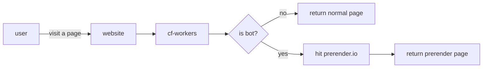

# How to setup
1. Clone this repo
2. Add these Actions secrets on github `CF_ACCOUNT_ID`, `CF_API_TOKEN`, `CF_ZONE_ID`, and `PRERENDER_API_KEY`
3. Update desired routes on `wrangler.toml`

# Background
For now, only Netlify support Prerendering. While waiting for Cloudflare Pages to support that also, this script aims to give the same result by using https://prerender.io/. Netlify is also using a forked version prerender on their end https://github.com/netlify/prerender.

## Limitation
Prerender.io have free tier pricing, which should be enough for a starter. Some limitations for the free tier:
| source | https://prerender.io/pricing/ |
| --- | --- |
| Caches/Recaches included | 1,000 / month |
| Cache Refresh Interval | 3-90 days |
| Additional Caching Budget | Not available |
| Render Geo Location | Shared |

## How it works
When a user visits on specified [routes](https://github.com/preschian/prerender-cf-workers/blob/main/wrangler.toml#L4), cf-workers will check the user by user_agent:

> **Note**
>  Sometimes take 2-20s to get the first prerender page. Meanwhile on cached version is faster.

## Demo
1. Open this page https://kodadot.preschian.xyz/rmrk/gallery/11238234-e0b9bdcc456a36497a-RMRKBNNRS-ARK_PROBABLY_NOTHING-0000000000000231
2. Share the url in the social media (discord or telegram also works)
3. Or, test it from https://www.opengraph.xyz/

Results:

> **Note**
>  This domain [kodadot.preschian.xyz](https://kodadot.preschian.xyz/) is running by using this repo https://github.com/preschian/nft-gallery/tree/main.
